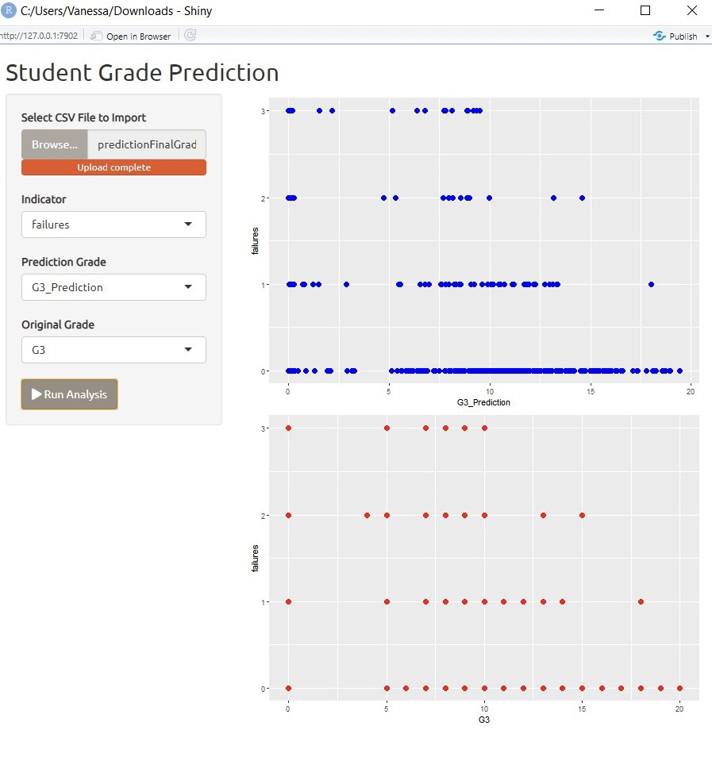
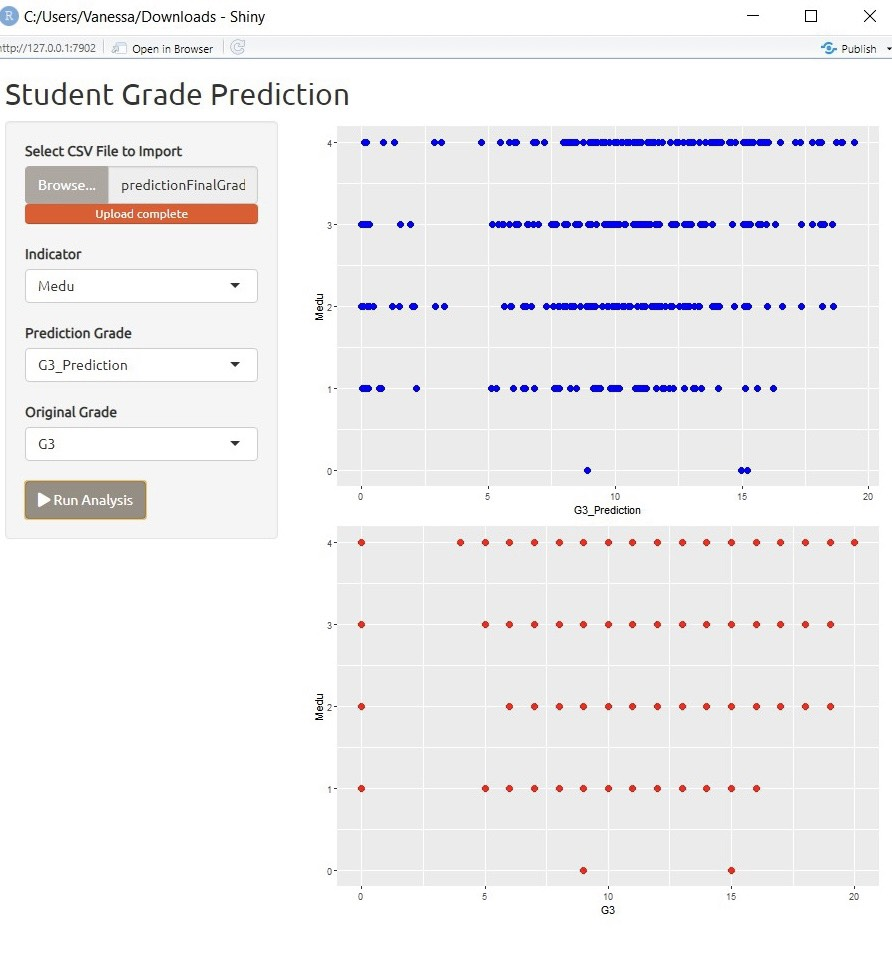

<!--
*** Thanks for checking out the Best-README-Template. If you have a suggestion
*** that would make this better, please fork the repo and create a pull request
*** or simply open an issue with the tag "enhancement".
*** Thanks again! Now go create something AMAZING! :D
-->


<!-- PROJECT SHIELDS -->
<!--
*** I'm using markdown "reference style" links for readability.
*** Reference links are enclosed in brackets [ ] instead of parentheses ( ).
*** See the bottom of this document for the declaration of the reference variables
*** for contributors-url, forks-url, etc. This is an optional, concise syntax you may use.
*** https://www.markdownguide.org/basic-syntax/#reference-style-links
-->
[![Contributors][contributors-shield]][contributors-url]
[![Forks][forks-shield]][forks-url]
[![Stargazers][stars-shield]][stars-url]
[![Issues][issues-shield]][issues-url]
[![MIT License][license-shield]][license-url]
[![LinkedIn][linkedin-shield]][linkedin-url]


<!-- PROJECT LOGO -->
<br />
<p align="center">
  <a href="https://github.com/othneildrew/Best-README-Template">
    
  </a>

  <h3 align="center">Best-README-Template</h3>

  <p align="center">
    An awesome README template to jumpstart your projects!
    <br />
    <a href="https://github.com/othneildrew/Best-README-Template"><strong>Explore the docs »</strong></a>
    <br />
    <br />
    <a href="https://github.com/othneildrew/Best-README-Template">View Demo</a>
    ·
    <a href="https://github.com/othneildrew/Best-README-Template/issues">Report Bug</a>
    ·
    <a href="https://github.com/othneildrew/Best-README-Template/issues">Request Feature</a>
  </p>
</p>


<!-- TABLE OF CONTENTS -->
<details open="open">
  <summary>Title</summary>
  <ol>
    <li>
      <a href="#about-the-project">About The Project</a>
      <ul>
        <li><a href="#built-with">Built With</a></li>
      </ul>
    </li>
    <li>
      <a href="#getting-started">Getting Started</a>
      <ul>
        <li><a href="#prerequisites">Prerequisites</a></li>
        <li><a href="#installation">Installation</a></li>
      </ul>
    </li>
    <li><a href="#usage">Usage</a></li>
    <li><a href="#roadmap">Roadmap</a></li>
    <li><a href="#contributing">Contributing</a></li>
    <li><a href="#license">License</a></li>
    <li><a href="#contact">Contact</a></li>
    <li><a href="#acknowledgements">Acknowledgements</a></li>
  </ol>
</details>


<!-- ABOUT THE PROJECT -->
## Student Grade Prediction - Riset Operational

## About The Project

This project is made to fulfill the final project for the Operational Research lecture. The goal of this project is to predict the final grade of a student given in dataset with the adaptation of machine learning, helped with the EDA analysis to see the most correlated indicators to the result. The data itself can be accessed on Kaggle “Student Grade Prediction” which comes from the University of Minho, Portugal. Those data consist of 33 columns which provide the approach of secondary student achievement in two Portuguese schools and were collected by using school reports and questioners. 

## Group Member and Contribution

Team 5 - Student Grade Prediction (https://www.kaggle.com/dipam7/student-grade-prediction)
Members:
1. Rolent Phan - 
2. Sherly Nathasya - Data Correlation and Visualization
3. Teofilus Michael - Prediction with Machine Learning
4. Vanessa Chriszella (Leader) - Front-end display and project report

## Methods

First, we compare three prediction models which are Tress, Random Forest, and SVM to see the accuracy of each model. We use Cross-Validation with Fold 10 at first which shows that Random Forest has the most accuracy. In the second comparison, we use Random Sampling with Training Set size 60% that leads to inaccuracy of all models. When we increase the Training Set size from 60% to 80%, it causes accuracy escalation of all models with Random Forest on the top of the list. Therefore, we use Random Forest as our method in this project due to the consistency of the accuracy. 

<!-- GETTING STARTED -->
## Performance

### Tree Amount Configuration
In Random Forest, the number of trees used greatly affects the quality of the resulting prediction model. The more trees you should use, the better the quality. However, there is research on the number of trees in Random Forest which states that even though the more trees used will increase the accuracy and precision, there is one point where the increase is insignificant and only creates a burden in the data processing. The study also states that the optimal number of trees, namely the right number before the increase in accuracy becomes insignificant, is between 64 and 128 trees. Taking this into account, we configured our prediction model in terms of the number of trees used by Random Forest.
After several experiments in Orange3, it can be seen that the more the number of trees, the higher the quality of the resulting model. However, when the number of trees was 128 and 256, they did not change significantly, and also the MAE value increased. Taking this into account and also keeping in mind the research results on this topic, we decided to use the number tree 128.

### Each Split Atribut Amount Configuration
To find the configuration that produces the highest quality model, we also try to configure the number of attributes to consider in each split. By using Orange3 to try, the best results are obtained when the configuration of the number of attributes considered is not configured, but using the default value of Orange3 so that the number of attributes considered is the root of the number of attributes in the data. Therefore, we will not configure this aspect of our model.
After trying several values in this parameter, it is found that the value obtained from the configuration experiment of the minimum value of the subset proves that the minimum value, which is 2, produces the best value among the other values. Therefore, it is this value that will be used.

### Tree Depth Level Configuration
Since the Decision Tree is highly influenced by its depth in terms of Pre-Pruning and Post-Pruning, and the Random Forest is a collection of Decision Trees, this needs to be configured as well for higher quality.
From the results of the experiment through Orange3, it can be seen that the highest Pre-Pruning value is when the Maximum Depth is 19, but this value is still lower than the default value, which is no Pre-Pruning. Therefore, the prediction model does not use Pre-Pruning.

### Replicable Training Configuration
The Replicalable Training parameter sets the seed of the Tree, so the result can be a replica. To obtain the highest value prediction model results, these parameters also need to be considered and configured.
From the experimental results, it can be concluded that Replicalable Training does not have a positive impact on the quality of the prediction model, therefore in this configuration, this parameter will not be activated.

### Balance Class Distribution Configuration
This parameter refers to the Weigh Classes of the data and when activated creates weigh classes that are inversely proportional to their frequency in the data. It must also be configured to improve the quality of the prediction model.
It can be seen from the results above that Balance Class Distribution, such as Replicalable Training has a negative impact on the value of the precision and accuracy of the prediction model. Therefore, this parameter will not be activated.


## Prediction

This is an example of how to list things you need to use the software and how to install them.
* npm
  ```sh
  npm install npm@latest -g
  ```

## Result








<!-- USAGE EXAMPLES -->
## References

Use this space to show useful examples of how a project can be used. Additional screenshots, code examples and demos work well in this space. You may also link to more resources.

_For more examples, please refer to the [Documentation](https://example.com)_


<!-- ROADMAP -->
