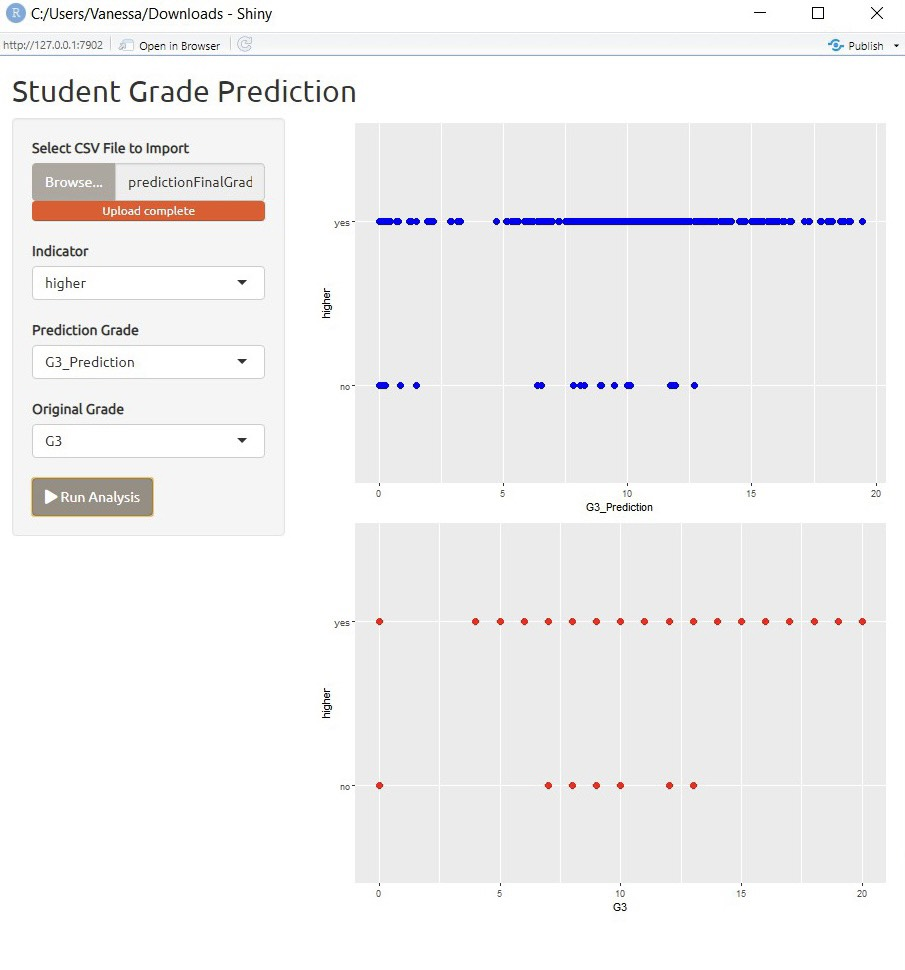

<!--
*** Thanks for checking out the Best-README-Template. If you have a suggestion
*** that would make this better, please fork the repo and create a pull request
*** or simply open an issue with the tag "enhancement".
*** Thanks again! Now go create something AMAZING! :D
-->

<!-- PROJECT SHIELDS -->
<!--
*** I'm using markdown "reference style" links for readability.
*** Reference links are enclosed in brackets [ ] instead of parentheses ( ).
*** See the bottom of this document for the declaration of the reference variables
*** for contributors-url, forks-url, etc. This is an optional, concise syntax you may use.
*** https://www.markdownguide.org/basic-syntax/#reference-style-links
-->
[![Contributors][contributors-shield]][contributors-url]
[![Forks][forks-shield]][forks-url]
[![Stargazers][stars-shield]][stars-url]
[![Issues][issues-shield]][issues-url]
[![MIT License][license-shield]][license-url]
[![LinkedIn][linkedin-shield]][linkedin-url]

<!-- PROJECT LOGO -->
 

  

  <h3 align="center">Best-README-Template</h3>

  

    An awesome README template to jumpstart your projects!
     
    <a href="https://github.com/othneildrew/Best-README-Template"><strong>Explore the docs »</strong></a>
     
     
    <a href="https://github.com/othneildrew/Best-README-Template">View Demo</a>
    ·
    <a href="https://github.com/othneildrew/Best-README-Template/issues">Report Bug</a>
    ·
    <a href="https://github.com/othneildrew/Best-README-Template/issues">Request Feature</a>
  

<!-- TABLE OF CONTENTS -->

  
Student Grade Prediction - Riset Operational

  <ol>
  <li><a href="#about-the-project">About The Project</a></li>
  <li><a href="#group-member-and-contribution">Group Member and Contribution</a></li>
  <li><a href="#methods">Methods</a></li>
    <li>
      <a href="#performance">Performance</a>
      <ul>
        <li><a href="#eda-result-and-explanation">EDA Result and Explanation</a></li>
        <li><a href="#machine-learning-evaluation">Machine Learning Evaluation</a></li>
          <ol>
            <li><a href="#tree-amount-configuration">Tree Amount Configuration</a></li>
            <li><a href="#each-split-atribut-amount-configuration">Each Split Atribut Amount Configuration</a></li>
            <li><a href="#tree-depth-level-configuration">Tree Depth Level Configuration</a></li>
            <li><a href="#replicable-training-configuration">Replicable Training Configuration</a></li>
            <li><a href="#balance-class-distribution-configuration">Balance Class Distribution Configuration</a></li>
          </ol>
      </ul>
    </li>
    <li>
      <a href="#prediction-and-result">Prediction and Result</a>
      <ul>
        <li><a href="#application-display">Application Display</a></li>
        <li><a href="#understand-the-graph">Understand the Graph</a></li>
        <li><a href="#prediction-based-on-age">Prediction Based on Age</a></li>
        <li><a href="#prediction-based-on-amount-of-failures">Prediction Based on Amount of Failures</a></li>
        <li><a href="#prediction-based-on-mother-education">Prediction Based on Mother Education</a></li>
        <li><a href="#prediction-based-on-father-education">Prediction Based on Father Education</a></li>
        <li><a href="#prediction-based-on-who-wants-to-have-higher-educationh">Prediction Based on Who Wants to Have Higher Education</a></li>
        <li><a href="#prediction-based-on-who-likes-to-go-out">Prediction Based on Who Likes to Go Out</a></li>
        <li><a href="#prediction-based-on-whose-having-romantic-relationship">Prediction Based on Whose Having Romantic Relationship</a></li>
      </ul>
    </li>
    <li><a href="#references">References</a></li>
  </ol>

<!-- ABOUT THE PROJECT -->
## Student Grade Prediction - Riset Operational

## About The Project

This project is made to fulfill the final project for the Operational Research lecture. The goal of this project is to predict the final grade of a student given in dataset with the adaptation of machine learning, helped with the EDA analysis to see the most correlated indicators to the result. The data itself can be accessed on Kaggle “Student Grade Prediction” which comes from the University of Minho, Portugal. Those data consist of 33 columns which provide the approach of secondary student achievement in two Portuguese schools and were collected by using school reports and questioners. 

## Group Member and Contribution

Team 5 - Student Grade Prediction (https://www.kaggle.com/dipam7/student-grade-prediction)
Members:
1. Rolent Phan - 
2. Sherly Nathasya - Data Correlation and Visualization
3. Teofilus Michael - Prediction with Machine Learning
4. Vanessa Chriszella (Leader) - Front-end Display and Project Report

## Methods

First, we compare three prediction models which are Tree, Random Forest, SVM, and Linear Regression to see the accuracy of each model. We use Cross-Validation with Fold 10 at first which shows that Random Forest has the most accuracy. In the second comparison, we use Random Sampling with Training Set size 60% that leads to inaccuracy of all models. When we increase the Training Set size from 60% to 80%, it causes accuracy escalation of all models with Random Forest on the top of the list. Therefore, we use Random Forest as our method in this project due to the consistency of the accuracy. 

<!-- GETTING STARTED -->
## Performance
### EDA Result and Explanation

In the Heatmap above, we can see several different colors that have different meanings. Each data in this heatmap is correlated between the rows and columns. The darker the color that is owned means that the data has a value that is far from the average. Meanwhile, the brighter the color it means that more the data has a value that is around the average. The dendrogram lines that are above and beside the heatmap indicate the correlation that exists in the row and column data. We can see from the data "age" that there are several mixed colors, meaning that the data in this column is correlated with the data in the row and is around the average value "or it can be interpreted that age does not have an effect on student scores. Then the data "schoolsup" and "famsize" have a color in the middle, meaning this data is on average "to affect student scores.

### Machine Learning Evaluation

#### Tree Amount Configuration
In Random Forest, the number of trees used greatly affects the quality of the resulting prediction model. The more trees you should use, the better the quality. However, there is research on the number of trees in Random Forest which states that even though the more trees used will increase the accuracy and precision, there is one point where the increase is insignificant and only creates a burden in the data processing. The study also states that the optimal number of trees, namely the right number before the increase in accuracy becomes insignificant, is between 64 and 128 trees. Taking this into account, we configured our prediction model in terms of the number of trees used by Random Forest.
After several experiments in Orange3, it can be seen that the more the number of trees, the higher the quality of the resulting model. However, when the number of trees was 128 and 256, they did not change significantly, and also the MAE value increased. Taking this into account and also keeping in mind the research results on this topic, we decided to use the number tree 128.

#### Attribute Considered in Each Split Configuration
To find the configuration that produces the highest quality model, we also try to configure the number of attributes to consider in each split. By using Orange3 to try, the best results are obtained when the configuration of the number of attributes considered is not configured, but using the default value of Orange3 so that the number of attributes considered is the root of the number of attributes in the data. Therefore, we will not configure this aspect of our model.
After trying several values in this parameter, it is found that the value obtained from the configuration experiment of the minimum value of the subset proves that the minimum value, which is 2, produces the best value among the other values. Therefore, it is this value that will be used.

#### Tree Depth Level Configuration
Since the Decision Tree is highly influenced by its depth in terms of Pre-Pruning and Post-Pruning, and the Random Forest is a collection of Decision Trees, this needs to be configured as well for higher quality.
From the results of the experiment through Orange3, it can be seen that the highest Pre-Pruning value is when the Maximum Depth is 19, but this value is still lower than the default value, which is no Pre-Pruning. Therefore, the prediction model does not use Pre-Pruning.

#### Replicable Training Configuration
The Replicable Training parameter sets the seed of the Tree, so the result can be a replica. To obtain the highest value prediction model results, these parameters also need to be considered and configured.
From the experimental results, it can be concluded that Replicalable Training does not have a positive impact on the quality of the prediction model, therefore in this configuration, this parameter will not be activated.

#### Balance Class Distribution Configuration
This parameter refers to the Weigh Classes of the data and when activated creates weigh classes that are inversely proportional to their frequency in the data. It must also be configured to improve the quality of the prediction model.
It can be seen from the results above that Balance Class Distribution, such as Replicalable Training has a negative impact on the value of the precision and accuracy of the prediction model. Therefore, this parameter will not be activated.

#### Final Model Performance Result
The result of the comparing machine learning models are as follows:
(gambar disini)
After all the configurations is applied, the resulting error rate of the model are as follows:

## Prediction and Result
This plots below show the result of Final Grade Prediction (G3) based on the most correlated indiactors gotten from Data Analysis and Visualization. 

### Application Display
When we run the application, we will see the Application Display. At the sidebarPanel (left side) we can upload the CVS file, then pick the indicator as the reference of the prediction. After that, we can click the Run Analysis button to view the result of the prediction.

### Understand the Graph
The graph shows us the prediction on the mainpanel (right side). The y-asix presents the indicator we choose before and the x-asix presents the result of student final grade.
For each indicators, there will be 2 dotplot graphs shown. The first dotplot graph presents the student finnal grade from the prediction with machine learning, while the second dotplot graph presents the student final grade based on the original data from Kaggle. To make user compare both of graphs easier, we set them as the different colour (blue for prediction and red for original data)

### Prediction Based on Age

### Prediction Based on Amount of Failures

### Prediction Based on Mother Education

### Prediction Based on Father Education

### Prediction Based on Who Wants to Have Higher Education

### Prediction Based on Who Likes to Go Out

### Prediction Based on Whose Having Romantic Relationship

<!-- USAGE EXAMPLES -->
## References
Breiman, L. (2001). Random Forests. In Machine Learning, 45(1), 5-32.

https://towardsdatascience.com/  

Introduction to SVM on StatSoft

https://medium.com/ 

https://mljar.com/ 

https://flowingdata.com/2010/01/21/how-to-make-a-heatmap-a-quick-and-easy-solution/

https://www.statmethods.net/graphs/dot.html

https://shiny.rstudio.com/gallery/

https://shiny.rstudio.com/tutorial/

https://towardsdatascience.com/how-to-build-a-data-analysis-app-in-r-shiny-143bee9338f7

http://www.sthda.com/english/wiki/ggplot2-colors-how-to-change-colors-automatically-and-manually

https://bbolker.github.io/R-ecology-lesson/04-visualization-ggplot2.html

https://thomasleeper.com/Rcourse/Tutorials/plotcolors.html

Oshiro, Thais & Perez, Pedro & Baranauskas, José. (2012). How Many Trees in a Random Forest?. Lecture notes in computer science. 7376. 10.1007/978-3-642-31537-4_13.

<!-- ROADMAP -->
